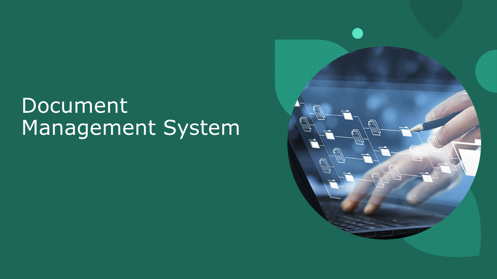
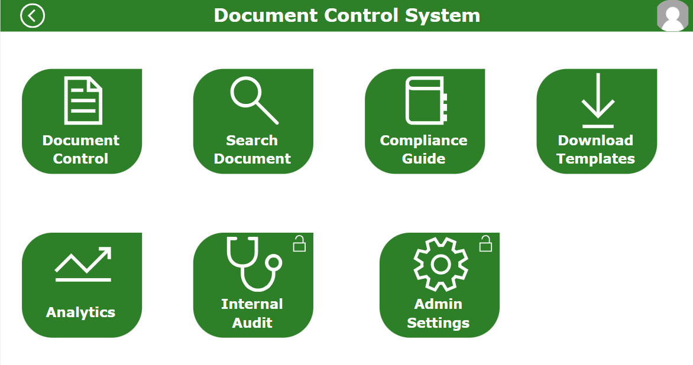
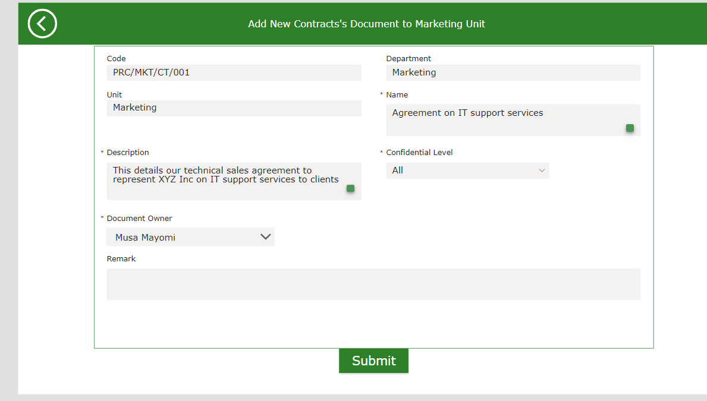
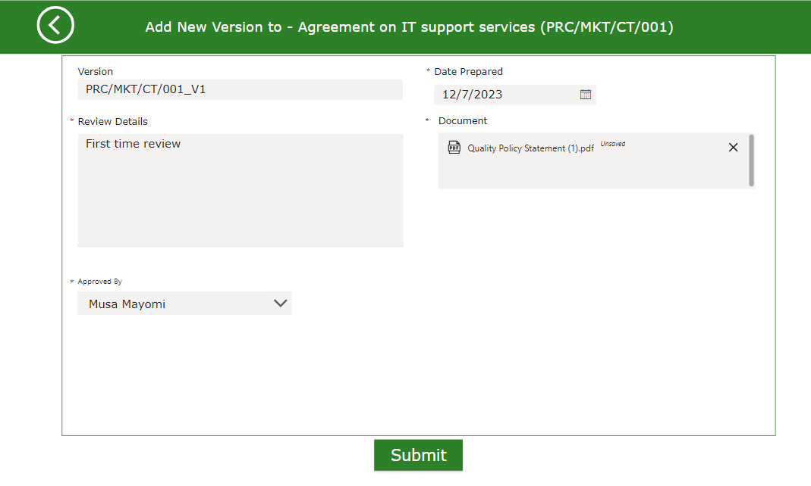
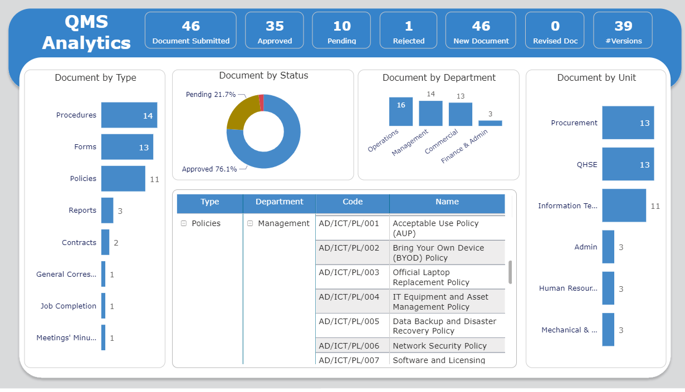

# Document-Management-System

## 1. Introduction

### 1.1 Overview
The Document Control Application is a Power platform-driven solution developed to optimize the document management lifecycle within an organizational context. This establishes a centralized hub facilitating the creation, storage, and monitoring of documents. Its primary objective is to fortify and streamline document control processes, fostering heightened efficiency and collaboration across the organizational landscape.

This application boasts an extensive array of features, including but not limited to document retrieval, seamless upload capabilities, real-time previews, intricate approval workflows, timely notifications, systematic archiving, version tracking, document analytics, and robust security protocols. Through this comprehensive suite of functionalities, organizations stand to benefit from a refined and cohesive document management framework, ensuring not only operational efficiency but also a secure and collaborative environment.
### 1.2 Key Features
- **Document Creation**: Create new documents directly within the app.
- **Version Control**: Track and manage document versions seamlessly.
- **Access Control**: Define user roles and permissions for document access.
- **Audit Trail**: Maintain an audit trail of document activities for compliance.
- **Search and Filters**: Easily locate documents using robust search and filtering options.
- **Document Control**: Segmentation of document to Types
- **Document Analytics**: provides insights and analysis on various aspects of documents, such as usage patterns, access history, and performance metrics.

# 2.0 Details
## 2.1 Skill Demonstrated
- Database: The app's data structure utilizes Microsoft Dataverse Tables for organizing data, establishing diverse relationships, and connecting to the app. Alternatively, SharePoint or SQL Server can serve the same purpose, requiring consistent field name maintenance.
- PowerApps: This employed to design a bespoke user interface, harnessing their adaptable design features to develop intuitive and personalized experiences for end-users.
- Power Automate: This was implemented to optimize and automate approval procedures within the application development framework, thereby fostering effective workflow administration and promoting enhanced collaboration among team members.
- Power BI: This was employed to craft visual representations that offer profound insights and analytical perspectives on diverse facets of documents, encompassing patterns of usage, access history, and performance metrics.

### 2.2 User Roles and controls
Within the application, three distinct roles have been delineated: super admin, editor, and viewer.
- The super admin is endowed with comprehensive privileges, enabling the creation, updating, reading, and deletion of not only their individual documents but also all accessible files across the application.
- An editor possesses the capability to create, edit, and update their own documents, peruse all other documents within their purview, and is limited to modifying document status to inactive without the authority to delete.
- The viewer's access is restricted to browsing documents or files granted explicit permission.

## 3. App Interface

### 3.1 Main Page

### 3.2 Document Management

#### 3.2.1 Document Creation

Create Name | Upload Document
:------------------:|:---------------------:
   | 

### 3.3 Document Analytics

